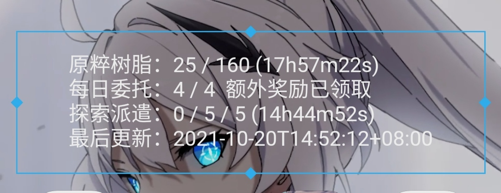

# Genshin DailyNote Helper | 原神每日助手
基于 KWGT 的 原神个人信息 显示  
此仓库为服务端实现

## Usage | 使用说明
### Configs | 可用配置说明
> 仅 `Cookie` 和 `is_SCF` 会从环境变量读取 优先级大于配置文件  
> 仅需填写需要用到的配置项 其余配置项均有默认值  
> 如果不需要本地日志留存请打开云函数模式

`config.json`
```json
{
    "ip": "0.0.0.0", // 监听的ip
    "port": 9000, // 监听的端口
    "cache_time": 300, // 缓存过期时间（单位秒）
    "cache_file": "/tmp/cache.json", // 缓存的文件位置 请使用绝对路径
    "cookie":" cookie string ", // Cookie
    "game_biz": "hk4e_cn", // 游戏服务器 默认为国服
    "is_SCF": false, // 云函数模式 使用环境变量时KEY 为 'SCF'
    "bh3_sign": false
}
```
`Environment Variables` | `环境变量`
```
COOKIE=" cookie string "
SCF=true|false
```
### Local Server | 本地服务器
- Clone 本仓库到本地
- 安装运行库 `Node JS`
- 复制 `config.json.example` 为 `config.json`
- 修改 `config.json` 的内容
- 运行主程序
```bash
yarn | npm install
node app.js
```
- 至此服务端部署完成 
### SCF | 云函数部署
>　例子采用腾讯云函数部署，可自行部署到其他环境
> [BV1DL411g7D2](https://www.bilibili.com/video/BV1DL411g7D2)
- 从git下载`zip格式`代码到本地
- 创建一个`Web函数`模式的`云函数`
- - 环境使用`NodeJS 12`
- - 代码选择`本地上传zip包` 上传刚刚下载的zip文件
- - **`环境变量`中设置`SCF`的值为`true`**
- - **`环境变量`中设置`COOKIE`的值为你的`cookie`**
- - 参考`COOKIE`格式`stuid=xxx;stoken=xxx;ltuid=xxx;ltoken=xxx;account_id=xxx;login_ticket=xxx;cookie_token=xxx;`
- - **注意大小写！**
- - `高级设置`中修改`超时时间`为30秒
- - 下图仅供参考
- 
- 
- 完成创建后会跳转到`函数配置`界面
- 打开`函数代码`页面 等待云编辑器加载完成
- 点击 `终端 -> 新终端`　在下方打开的终端运行下列指令
```bash
cd src/genshin-dailynote-helper-%version% # %version% 请替换为下载下来的文件夹名称 可以在云函数编辑器左侧看到
cp config.json.example config.json
rm -f ./../scf_bootstrap
cp -f tencent_scf_bootstrap ./../scf_bootstrap
yarn

```
> 可选操作：
> - 创建并修改 `config.json` 的内容
> - - 可选项参考上方配置文件说明
- 点击`部署`来提交修改
- 根据下方的`访问路径`来访问服务
- - 如路径为`https://aa.bb.cc/release/` 则访问 `https://aa.bb.cc/release/resin` 其他接口同理
## Notice | 注意事项
- 需要开启米游社－我的－我的角色－实时便笺（jian）功能
- 请不要将你的cookie分享给任何人(config.json)
- 查询的角色为米游社中选择的默认角色 理论支持所有国内渠道 暂不支持国际服(欢迎pr)

## API | 可用接口
- `/resin` 获取格式化每日数据
- `/resin/all` 获取官方接口完整数据
- `/resin/force_refresh` 强制刷新缓存数据 **(只会返回刷新是否成功！)**
- `/bh3/sign` 崩坏3 `福利补给` 领取 **需要在配置文件手动启用**
## KWGT sample | KWGT 参考代码

[Yife_Playte的小部件](https://github.com/YifePlayte/genshin-dailynote-helper/blob/main/GenshinInfo.kwgt)  
  
> **注意：仅包含文字部分 背景请自行设置**

纯文本格式:
```
原粹树脂：$wg(your.url/resin, json, .resin)$ 
每日委托：$wg(your.url/resin, json, .task)$ 
探索派遣：$wg(your.url/resin, json, .expedition)$
最后更新：$wg(your.url/resin, json, .last_update)$
```

## Get cookie | 获取 Cookie 
Cookie 获取参考 
- 访问 [https://user.mihoyo.com](https://user.mihoyo.com) 并登录账号 如果已经登陆请退出后重新登录
- 获取 `cookie` 中 `login_ticket` 项
- 确认已经复制好 `config.json`
- 确认已经安装好 `nodejs` 和所需依赖库
- 运行 `node cookie.js <login_ticket>` 
- - 注意：将 `<login_ticket>` 替换为上一步获取的值
- - 为了个人账号安全 请不要将cookie分享给任何人
- 接下来程序将自动修改 `config.json` 的值 如果修改失败可以从输出中获取内容并手动修改

## Update Log | 更新日志
[2021.12.01]
- 有小天才没有推送commit但我不说是谁（

[2021.11.01]
- 修复本地日志文件输出没有换行的问题
- 增加崩坏3福利补给的获取查询 原神的在做了((( 三蹦子是隔壁项目有现成的轮子改个活动id就能用
- 微调部分代码

[2021.10.27]
- 修复SCF模式读取优先级错误
- 更改可能会卡住的云函数部署命令部分

[2021.10.26]
- 重写配置文件读取系统
- 增加了几个可配置项目
- 完善了云函数部署指引

[2021.10.25]
- 添加云函数运行模式
- 编写基础的腾讯云函数部署指引
- 将 `cache.json` 移动到 `/tmp` 下

[2021.10.22]
- 添加写出到文件的日志

[2021.10.20]
- 重构并拆分部分代码 便于后期维护
- 合并完整数据请求接口
- 更改默认格式化文本
- 迁移 request 到 superagent
- 完善文档

[2021.10.19] 
- 增加自适应角色获取
- 修复cache不存在的报错
- 修复首次启动时cache错误的缓存导致的无法正常运行
- 添加其他优秀的KWGT小部件地址
- 添加cookie的获取说明
- 开始记录更新日志
## Thanks | 感谢名单
@Azure99 @2314933036 提供了 `DS` 字段的算法和所用的 `salt`  
部分源码基于 `jianggaocheng/mihoyo-signin` 项目修改而来  
@YifePlayte 积极反馈bug 和 设计了好看的kwgt部件  
给予star支持的你  
